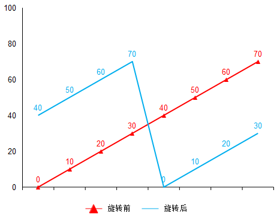

# LC153. 寻找旋转排序数组中的最小值

## 思路

1、如果按序遍历数组寻找最小值，算法的时间复杂度为O(n)，不能满足O(logn)的算法时间复杂度要求。

2、因为题目规定的时间复杂度为O(logn)，同时数组也是升序排列，那么已经提示需要使用二分搜索。但是将数组旋转后数组将不再是一个升序数组，而是将数组分为了两段升序区间的组合。如何在两段升序期间的集合中选择最小值？

## **解题方法**

如下图所示，红线表示升序数组，蓝线表示选择后的升序数组。因为数组中的所有元素均不相同，那么红线完全单调递增，而蓝线将会分成两段递增的区间组合。**注意：若数组旋转次数和数组个数相同，那么将会和原数组完全一致。**



若寻找旋转数组中的最小值，那么**数组中的最小值必定小于或者等于数组的尾部元素**。因此，算法的实现就是查询大于或者等于数组尾部元素的最小值。实现代码如下：

```c++
class Solution {
public:
    int findMin(vector<int>& nums) {
        int left = 0;
        int right = nums.size() - 1; 
        while (left < right) {
            int mid = left + (right - left) / 2;
            if (nums[mid] <= nums.back()) {
                right = mid;
            } else {
                left = mid + 1;
            }
        }
        return nums[right];
    }
};
```

## 复杂度分析

时间复杂度：O(logn)

空间复杂度：O(1)