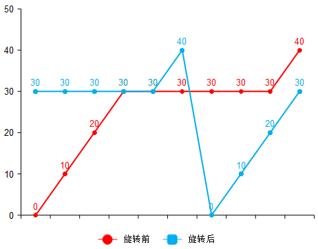

> Problem: [154. 寻找旋转排序数组中的最小值 II](https://leetcode.cn/problems/find-minimum-in-rotated-sorted-array-ii/description/)

[TOC]

# 思路
1、如果按序遍历数组查询最小值，算法的时间复杂度为O(n)，但是未充分利用数组的有序性；

2、由于数组是有序数组，可以尝试使用二分搜索。若将数组旋转后，数组将会划分为两部分，由于数据存在重复元素，前一部分的数据将大于等于数组的尾部数据，而后一部分的数据将小于等于数组的尾部数据。问题的关键是如何处理和尾部数据相等的数据？

# 解题方法
如下图所示：



蓝色线为旋转后的有序数组，线段可以分成两部分，在最小值左边的区间的元素均大于等于数组的尾部数据，最小值右边的区间的元素均小于等于数组的尾部数据。基于二分搜索选择中间元素，将分为如下几种情况：

1、若中间元素大于尾部元素，此时中间元素位于左边区间，直接将left设置为mid + 1；

2、若中间元素小于尾部元素，此时中间元素位于左边区间，直接将right设置为mid；

3、若中间元素等于尾部元素，此时无法确定中间元素位于左边区间还是右边区间，此时可以将right设置为right - 1，如果nums[right - 1]的元素小于nums[right]，基于nums[right - 1]这个新标定点继续查询，而如果nums[right - 1]大于nums[right]，那么最小值就是nums[right]，不过nums[mid]仍在搜索区间，继续查询可以得到结果。

# 复杂度
- 时间复杂度: 
> 添加时间复杂度, 示例： $O(n)$

- 空间复杂度: 
> 添加空间复杂度, 示例： $O(n)$

# Code
```C++ []

class Solution {
public:
    int findMin(vector<int>& nums) {
        int left = 0;
        int right = nums.size() - 1;
        while (left < right) {
            int mid = left + (right - left) / 2;
            if (nums[mid] < nums[right]) {
                right = mid;
            } else if (nums[mid] > nums[right]) {
                left = mid + 1;
            } else {
                --right;
            }
        }
        return nums[left];
    }
};
```