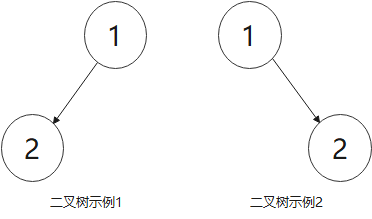
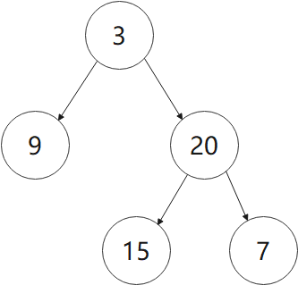
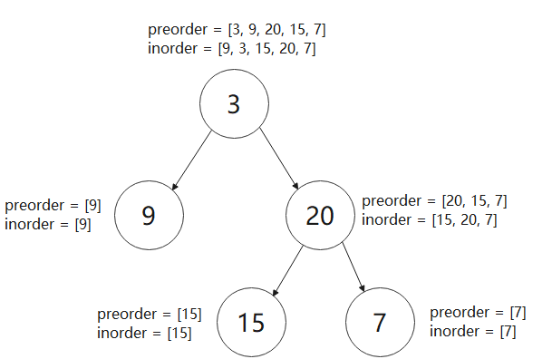
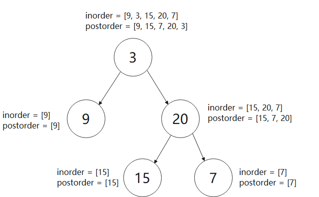

## 如何通过二叉树的遍历结果还原一颗二叉树？

当我们学习二叉树时，肯定都学过二叉树的遍历。二叉树的遍历通过递归的方式非常容易实现，基于深度优先搜索(DFS)遍历二叉树节点分别实现二叉树的前序、中序和后序遍历。c++基本代码如下所示：

```c++
struct TreeNode {
	int val;
    TreeNode* left;
    TreeNode* right;
};

void dfs(TreeNode* node) {
    if (node == nullptr) {
		return;  // 当节点不存在时，递归终止
    }
    
    // 在这里对节点的数据操作就是二叉树的前序遍历
    dfs(node->left);
    // 在这里对节点的数据操作就是二叉树的中序遍历
    dfs(node->right);
    // 在这里对节点的数据操作就是二叉树的后序遍历
}
```

那么，当获得了二叉树的遍历结果，**如果仅仅给出二叉树的前序遍历和后序遍历结果，能不能还原出一颗二叉树呢**？

因为二叉树的前序遍历在首次访问到节点后就将节点的数据保存至遍历结果中，而后序遍历是在访问完节点的左右子树后再将节点的数据保存至遍历结果中。虽然先序遍历和后序遍历都可以确定二叉树根节点的值，但是对于先序遍历结果除开头元素外的其他结果，或者后序遍历结果除开尾元素的其他结果，无法判断出根节点左右子树的遍历结果，因此无法还原出一颗二叉树。简单示例如下：



对于二叉树示例1还是二叉树示例2，其前序遍历结果均为[1, 2]，后续遍历结果均为[2, 1]。因此，无法通过二叉树的前序遍历和后续遍历还原出一颗二叉树。

那么，**能不能基于二叉树的先序遍历和中序遍历结果还原出一颗二叉树呢**？以leetcode第105号题为例，给定一颗二叉树的先序遍历结果数组和中序遍历结果数组，还原这颗二叉树并返回其根节点。如下图所示：



二叉树的先序遍历结果为[3, 9, 20, 15, 7]，中序遍历结果为[9, 3, 15, 20, 7]。

二叉树的先序遍历结果可以确定根节点的值。与此同时，二叉树的中序遍历可以确定根节点左右子树的中序遍历结果，而二叉树中序遍历根节点左边的结果为左子树的中序遍历结果，根右边的结果为右子树的中序遍历结果。同时，根据左右子树的中序遍历结果的个数，在先序遍历中也可确定左子树的先序遍历结果和右子树的先序遍历结果。

在分别获取到左右子树的先序和中序遍历结果后，可继续迭代处理，这样就还原出整颗二叉树。上图的示例递归处理示意图如下：



c++代码如下：

```c++
class Solution {
public:
    TreeNode* buildTree(vector<int>& preorder, vector<int>& inorder) {
        return dfs(preorder, 0, preorder.size() - 1, inorder, 0, inorder.size() - 1);
    }

private:
    TreeNode* dfs(vector<int>& preorder, int preLeft, int preRight, vector<int>& inorder, int inLeft, int inRight) {
        if (preLeft > preRight) {
            return nullptr;
        }

        TreeNode* root = new TreeNode(preorder[preLeft]);

        int leftChildCnt = 0;  // 获取根节点左子树节点的个数
        while (preorder[preLeft] != inorder[inLeft + leftChildCnt]) {
            ++leftChildCnt;
        }

        root->left = dfs(preorder, preLeft + 1, preLeft + leftChildCnt, inorder, inLeft, inLeft + leftChildCnt - 1);
        root->right = dfs(preorder, preLeft + leftChildCnt + 1, preRight, inorder, inLeft + leftChildCnt + 1, inRight);

        return root;
    }
};
```

同理，**能不能基于二叉树的后序遍历和中序遍历结果还原出一颗二叉树呢**？以leetcode第106号题为例，给定一颗二叉树的后序遍历结果数组和中序遍历结果数组，还原这颗二叉树并返回其根节点。如下图所示：如下图所示：（注：与前面的图一致）


二叉树的后序遍历结果为[9, 15, 7, 20, 3]，中序遍历结果为[9, 3, 15, 20, 7].

思路同上个例子基本一致，二叉树的后序遍历结果可以确定根节点的值。与此同时，二叉树的中序遍历可以确定根节点左右子树的中序遍历结果，而二叉树中序遍历根节点左边的结果为左子树的中序遍历结果，根右边的结果为右子树的中序遍历结果。同时，根据左右子树的中序遍历结果的个数，在后面遍历中也可确定左子树的后序遍历结果和右子树的后序遍历结果。

在分别获取到左右子树的后序和中序遍历结果后，可继续迭代处理，这样就还原出整颗二叉树。上图的示例递归处理示意图如下：



c++代码如下：

```c++
class Solution {
public:
    TreeNode* buildTree(vector<int>& inorder, vector<int>& postorder) {
        return dfs(inorder, 0, inorder.size() - 1, postorder, 0, postorder.size() - 1);
    }

private:
    TreeNode* dfs(vector<int>& inorder, int inLeft, int inRight, vector<int>& postorder, int postLeft, int postRight) {
        if (postLeft > postRight) {
            return nullptr;
        }

        TreeNode* root = new TreeNode(postorder[postRight]);

        int leftChildCnt = 0;  // 获取根节点左子树节点的个数
        while (postorder[postRight] != inorder[inLeft + leftChildCnt]) {
            ++leftChildCnt;
        }

        root->left = dfs(inorder, inLeft, inLeft + leftChildCnt - 1, postorder, postLeft, postLeft + leftChildCnt - 1);
        root->right = dfs(inorder, inLeft + leftChildCnt + 1, inRight, postorder, postLeft + leftChildCnt, postRight - 1);

        return root;
    }
};
```

注意：在上述代码里面，为了获取根节点左子树节点的个数，通过在中序遍历结果中轮询遍历获取根节点的值，代码片段为：

```c++
int leftChildCnt = 0;  // 获取根节点左子树节点的个数
while (postorder[postRight] != inorder[inLeft + leftChildCnt]) {
    ++leftChildCnt;
}
```

因此，这里有一个非常重要的前提条件，**在二叉树中节点均有不同的值组成，如果有相同值，那么则无法基于中序遍历准确判断出根节点左右子树的节点个数**。

**那么，如上解法能不能对算法进一步优化呢？**

在上述解法中，基于深度优先搜索（DFS）递归遍历节点，然而在每次递归操作中都需要通过while循环遍历去获取根节点左子树节点的个数，如果二叉树退化成链表，那么将会导致时间复杂度劣化到O(n^2^)。为了降低时间复杂度，通过哈希表保存中序遍历结果，避免while循环对节点的轮询访问。优化后c++代码如下：

```c++
class Solution {
public:
    TreeNode* buildTree(vector<int>& inorder, vector<int>& postorder) {
        for (int i = 0; i < inorder.size(); ++i) {
            buffer_[inorder[i]] = i;
        }
        return dfs(0, inorder.size() - 1, postorder, 0, postorder.size() - 1);
    }

private:
    TreeNode* dfs(int inLeft, int inRight, vector<int>& postorder, int postLeft, int postRight) {
        if (postLeft > postRight) {
            return nullptr;
        }

        TreeNode* root = new TreeNode(postorder[postRight]);
        auto it = buffer_.find(postorder[postRight]);
        assert(it != buffer_.end());  // 通过断言保证获取的迭代器肯定有效
        // int leftChildCnt = it->second - 1 - inLeft + 1 =  it->second - inLeft, 将leftChildCnt带入运算

        root->left = dfs(inLeft, it->second - 1, postorder, postLeft, postLeft + (it->second - inLeft) - 1);
        root->right = dfs(it->second + 1, inRight, postorder, postLeft + (it->second - inLeft), postRight - 1);

        return root;
    }

    unordered_map<int, int> buffer_;
};
```

通过空间换时间，时间复杂度优化至O(n)


