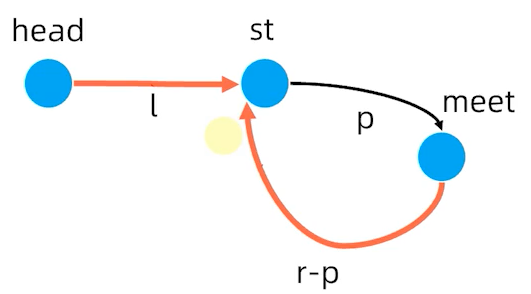

# 数组&链表

## 原理

数组：在内存中是**一段连续**的存储空间，可支持随机访问。

链表：在内存中是**一段非连续**的存储空间，通过指针将不同的元素串联起来。不支持随机访问。

时间复杂度：

|   操作   | 数组时间复杂度 | 链表时间复杂度 |
| :------: | :------------: | :------------: |
|   查询   |      O(1)      |      O(n)      |
|   插入   |      O(n)      |      O(1)      |
|   删除   |      O(n)      |      O(1)      |
| 尾部插入 |      O(1)      |      O(1)      |
| 头部插入 |      O(n)      |      O(1)      |

## 数组&链表问题

### 1、数组和链表的相同和差异点？

|                | 数组             | 链表                                               |
| -------------- | ---------------- | -------------------------------------------------- |
| 存储空间连续性 | 连续性，顺序存储 | 非连续，随机存储，因为额外的存储指针导致空间大一些 |
| 元素访问       | 支持随机访问     | 遍历访问                                           |
| 元素插入删除   | 时间复杂度O(n)， | 时间复杂度O(1)                                     |

### 2、变长数组如何设计？

关键点：

- 支持索引和随机访问
- 空间不够用如何扩展
- 空间剩余很多如何回收

## 典型应用场景

### 1、过滤器思想

遍历数组，将满足条件的元素放入至结果集合中，**常用于数组的保序操作处理**。代码模板如下：

```c++
for (int i = 1; i < nums.size(); ++i) {
    if (condition) {  // 过滤器
		// 满足过滤器判断后，结果集合处理
    }
}
```

## 典型题目

### 1、删除有序数组中的重复项（过滤器思想）

题目：给你一个 **升序排列** 的数组 `nums` ，请你**[ 原地](http://baike.baidu.com/item/原地算法)** 删除重复出现的元素，使每个元素 **只出现一次** ，返回删除后数组的新长度。元素的 **相对顺序** 应该保持 **一致** 。由于在某些语言中不能改变数组的长度，所以必须将结果放在数组nums的第一部分。更规范地说，如果在删除重复项之后有 `k` 个元素，那么 `nums` 的前 `k` 个元素应该保存最终结果。将最终结果插入 `nums` 的前 `k` 个位置后返回 `k` 。

不要使用额外的空间，你必须在 **[原地 ](https://baike.baidu.com/item/原地算法)修改输入数组** 并在使用 O(1) 额外空间的条件下完成。

限制条件：

- 1 <= nums.length <= 3 * 10^4^
- -10^4^ <= nums[i] <= 10^4^
- nums 已按 升序 排列

思路：

遍历有序数组，在遍历数组过程中可通过**过滤器**的思想将满足条件的元素保存至结果集合中。

解题方法：

1、初始化。初始化类型为`int`的临时变量size，用于保存数组的新长度，将size初始值设置为1，因为数组第一个元素肯定是非重复的。

2、数组遍历，过滤条件。从索引为1开始遍历数组，如果该元素值和前一个元素值相等，则不能将其放入至结果集合中。否则，将其放入至结果集合中，因为要原地修改输入数组，则直接将值保存至输入数组中，并且同时更新临时变量size。

3、设置结果。将临时变量size作为最终结果。

复杂度：

- 时间复杂度：$O(n)$，需要遍历数组。
- 空间复杂度：$O(1)$，无需额外空间保存结果。

代码：

```c++
class Solution {
public:
    int removeDuplicates(vector<int>& nums) {
        int size = 1;
        for (int i = 1; i < nums.size(); ++i) {
            if (nums[i] != nums[i - 1]) {  // 过滤器，如果前后两个元素值不相等，才能将结果保存至结果集合中
                nums[size] = nums[i];
                ++size;
            }
        }
        return size;
    }
};
```

### 2、移动零（过滤器思想）

题目：给定一个数组 `nums`，编写一个函数将所有 `0` 移动到数组的末尾，同时保持非零元素的相对顺序。**请注意** ，必须在不复制数组的情况下原地对数组进行操作。

限制条件：

- 1 <= nums.length <= 10^4^
- -2^31^ <= nums[i] <= 2^31^ - 1

思路：

遍历数组，当元素非0时才将元素保存至结果集合中，当遍历完后再将结果集合尾部的元素设置为0。

解题方法：

1、初始化。初始化类型为`int`的临时变量size，用于保存非零元素的数组长度，将size初始值设置为0。

2、遍历数组，过滤条件。从索引为0开始遍历数组，如果元素值非0，将其放入至结果集合中，并且同时更新size。

3、遍历完数组后，更新尾部元素值为0。当遍历完数组后，输入数组在区间[0, size)值不为0，需要将输入数组区间[size, nums.size())更新为0。

复杂度：

- 时间复杂度：$O(n)$，需要遍历数组。
- 空间复杂度：$O(1)$，无需额外空间保存结果。

代码：

```c++
class Solution {
public:
    void moveZeroes(vector<int>& nums) {
        int size = 0;
        for (int i = 0; i < nums.size(); ++i) {
            if (nums[i] != 0) {
                nums[size] = nums[i];
                ++size;
            }
        }
        while (size < nums.size()) {
            nums[size] = 0;
            ++size;
        }
    }
};
```

### 3、合并两个有序数组

题目：给你两个按 **非递减顺序** 排列的整数数组 `nums1` 和 `nums2`，另有两个整数 `m` 和 `n` ，分别表示 `nums1` 和 `nums2` 中的元素数目。请你 **合并** `nums2` 到 `nums1` 中，使合并后的数组同样按 **非递减顺序** 排列。

**注意：**最终，合并后数组不应由函数返回，而是存储在数组 `nums1` 中。为了应对这种情况，`nums1` 的初始长度为 `m + n`，其中前 `m` 个元素表示应合并的元素，后 `n` 个元素为 `0` ，应忽略。`nums2` 的长度为 `n` 。

限制条件：

- nums1.length == m + n
- nums2.length == n
- 0 <= m, n <= 200
- 1 <= m + n <= 200
- -10^9^ <= nums1[i], nums2[j] <= 10^9^

思路：

倒序将两个数组进行合并处理。

解题方法：

1、初始化。创建类型为`int`的`i`，`j`，`k`三个临时变量用于保存数组索引，分别将其初始值设置为m - 1，n - 1，m + n - 1。

2、倒序遍历数组。倒序遍历数组，将结果保存至数组`nums1`中。注意边界条件的判断处理

复杂度：

- 时间复杂度：$O(m + n)$，需要遍历两个数组的所有元素。
- 空间复杂度：$O(1)$，无需额外空间保存结果。

代码：

```c++
class Solution {
public:
    void merge(vector<int>& nums1, int m, vector<int>& nums2, int n) {
        int i = m - 1;
        int j = n - 1;
        int k = m + n - 1;
        while ((i >= 0) || (j >= 0)) {
            if ((j < 0) || ((i >= 0) && (nums1[i] >= nums2[j]))) {
                nums1[k] = nums1[i];
                --i;
            } else {
                nums1[k] = nums2[j];
                --j;
            }
            --k;
        }
    }
};
```

举一反三：

1、为什么倒序遍历处理数据不会有问题，但是正序处理数据存在问题？

2、该处理和归并排序的归并处理非常类似，在归并排序时可以重点关注归并的操作处理。

### 4、反转链表（迭代和递归）

题目：给你单链表的头节点 `head` ，请你反转链表，并返回反转后的链表。

限制条件：

- 链表中节点的数目范围是 [0, 5000]
- -5000 <= Node.val <= 5000

思路1：迭代

遍历链表，不断记录前后两个节点，并且让后面的节点重新指向前面的节点，从而实现链表的反转。

解题方法1：

1、初始化。定义两个临时节点的指针，用于保存前一个节点和当前节点。

2、遍历链表。不断遍历链表，将当前节点指向前一个节点，然后更新前一个节点和当前节点。

3、设置结果。由于遍历结束的条件是当前节点为空，若当前节点为空，则表示访问完所有链表节点，直接将前一个节点作为最终节点。

复杂度：

- 时间复杂度：$O(n)$，n为链表节点个数，需要遍历所有节点
- 空间复杂度：$O(1)$

代码：

```c++
class Solution {
public:
    ListNode* reverseList(ListNode* head) {
        ListNode* pre = nullptr;
        ListNode* cur = head;
        while (cur != nullptr) {
            ListNode* next = cur->next;
            cur->next = pre;
            pre = cur;
            cur = next;
        }
        return pre;
    }
};
```

思路2：递归

通过递归遍历所有链表，先递归到最后一个节点，作为最终结果返回，然后在递归出栈的每一层节点，修改每个节点的值，将该节点的下一个节点指向自己，然后将自己的下一个节点设置为nullptr。

复杂度：

- 时间复杂度：$O(n)$，n为链表节点个数，需要遍历所有节点
- 空间复杂度：$O(n)$，n为链表节点个数，访问每个节点均存在栈的固定开销，最多为n层

代码：

```c
class Solution {
public:
    ListNode* reverseList(ListNode* head) {
        if ((head == nullptr) || (head->next == nullptr)) {
            return head;
        }

        ListNode* ans = reverseList(head->next);  // 注意：这里需要传递head->next参数而非head参数，避免无限循环

        head->next->next = head;
        head->next = nullptr;

        return ans;
    }
};
```

### 5、K 个一组翻转链表

题目：给你链表的头节点 `head` ，每 `k` 个节点一组进行翻转，请你返回修改后的链表。`k` 是一个正整数，它的值小于或等于链表的长度。如果节点总数不是 `k` 的整数倍，那么请将最后剩余的节点保持原有顺序。

你不能只是单纯的改变节点内部的值，而是需要实际进行节点交换。

限制条件：

- 链表中的节点数目为 n
- 1 <= k <= n <= 5000
- 0 <= Node.val <= 1000

思路：

遍历链表，每次遍历完k个节点后，将这k个节点进行翻转，不断迭代处理。

解题方法：

1、定义哑结点。如果头节点为空指针，便于归一处理。

2、遍历节点。若节点不为空，不退出循环处理。

3、获取k个节点的尾节点。先获取每k个节点一组的尾节点，如果节点为空，表示无法凑成k个节点，直接退出循环，否则进入到下一步操作。

4、翻转链表。将k个节点进行翻转。注意需要保存尾节点的下一个节点信息，因为在翻转后会更新该节点信息。

5、更新链表节点数据。将k个节点翻转后，更新该组节点首尾的连接信息。

6、设置结果。在遍历完链表的所有节点后，将哑结点的下一个节点作为最终结果。

复杂度：

- 时间复杂度：$O(n)$，n为链表节点个数，需要遍历所有节点
- 空间复杂度：$O(1)$，仅需固定空间保存临时变量

代码：

```c++
class Solution {
public:
    ListNode* reverseKGroup(ListNode* head, int k) {
        auto dummy = make_unique<ListNode>(0, head);
        ListNode* pre_head = dummy.get();  

        while (head != nullptr) {
            ListNode* tail = getSubTailNode(head, k);
            if (tail == nullptr) {
                break;
            }

            // 注意：这里需要先保存下一组的头节点信息，因为在翻转链表后tail->next值被修改
            ListNode* next_tail = tail->next;  
            pre_head->next = reverseList(head, next_tail);
            // head节点在翻转后为尾节点，下一个节点为空指针，需要更新head->next为下一组的头节点
            head->next = next_tail;

            // 重新更新pre_head和head信息，进入下一轮循环处理中
            pre_head = head;
            head = next_tail;
        }

        return dummy->next;
    }

    ListNode* getSubTailNode(ListNode* head, int k) {
        while ((head != nullptr) && (--k != 0)) {
            head = head->next;
        }
        return head;
    }

    ListNode* reverseList(ListNode* head, ListNode* next_tail) {
        ListNode* pre = nullptr;
        ListNode* cur = head;
        while (cur != next_tail) {
            ListNode* next = cur->next;
            cur->next = pre;
            pre = cur;
            cur = next;
        }
        return pre;
    }
};
```

### 6、合并两个有序链表

题目：将两个升序链表合并为一个新的 **升序** 链表并返回。新链表是通过拼接给定的两个链表的所有节点组成的。

限制条件：

- 两个链表的节点数目范围是 [0, 50]
- -100 <= Node.val <= 100
- l1 和 l2 均按 非递减顺序 排列

思路：创建一个哑结点，分别遍历两个链表，比较两个节点的值，将满足条件的节点放到哑结点后面，并且不断更新节点信息。

解题方法：

1、创建哑结点并拷贝哑结点指针。

2、遍历两个链表。若两个链表节点均不为空，判断节点值大小，并更新哑结点信息。否则退出循环。

3、设置最终结果。

复杂度：

- 时间复杂度：$O(m + n)$，m和n分别为两个链表的长度
- 空间复杂度：$O(1)$，仅仅需要固定的空间保存节点

代码：

```c++
class Solution {
public:
    ListNode* mergeTwoLists(ListNode* list1, ListNode* list2) {
        auto dummy = make_unique<ListNode>();
        ListNode* node = dummy.get();

        while ((list1 != nullptr) && (list2 != nullptr)) {
            if (list1->val <= list2->val) {
                node->next = list1;
                list1 = list1->next;
            } else {
                node->next = list2;
                list2 = list2->next;
            }
            node = node->next;
        }

        node->next = (list1 != nullptr) ? list1 : list2;

        return dummy->next;
    }
};
```

### 7、邻值查找

链接：https://www.acwing.com/problem/content/description/138/

题目：给定一个长度为 n 的序列 A，A 中的数各不相同。对于 A 中的每一个数 A~i~，求：min~1≤j<i~|A~i~−A~j~|
以及令上式取到最小值的 j（记为 P~i~）。若最小值点不唯一，则选择使 A~j~ 较小的那个。

n≤10^5^,|A~i~|≤10^9^

思路：

为了获取min~1≤j<i~|A~i~−A~j~|，可以将数组按照从小到大进行排序，这样当索引为i时，可通过排序后的前后两个值和该值做处理，从而获取绝对值最小值。

当数组索引为i时，能够获取的值的范围为1≤j<i，可尝试通过双向链表保存排序后的结果，这样无论是插入还是删除节点的开销时间复杂度为O(1)，同时为了快速获取节点信息，可通过额外的数组空间保存节点信息。

解题方法：

1、处理输入数组。创建类型为`vector<int>`的`data`保存输入数据。

2、排序。创建类型为`vector<int>`的`rank`保存`data`排序后的结果，`rank`中保存了将`data`排序后的数组索引信息。

3、创建双向链表。为了简化链表操作，首先创建头尾两个哑结点，在内部分别设置其索引值。然后遍历数组`rank`，依次将节点加入至双向链表中。并且通过类型为`vector<unique_ptr<Node>>`的`pos`保存所有链表节点信息，便于快速访问。

4、获取结果。创建类型为`vector<int>`的`ans`保存数组每个位置能够获取到min~1≤j<i~|A~i~−A~j~|的位置，从尾到头依次遍历`pos`，将结果保存至`pos`后并且删除链表节点。

5、输出结果。基于要求的格式输出最终结果。

复杂度：

- 时间复杂度：$O(nlogn)$，n为输入的序列长度，主要耗时点主要在数组排序。
- 空间复杂度：$O(n)$，n为输入的序列长度。

代码：

```c++
#include <iostream>
#include <vector>
#include <algorithm> 
#include <memory>

using namespace std;

struct Node {
    int index = 0;
    Node* prev = nullptr;
    Node* next = nullptr;
};

unique_ptr<Node> addNode(Node* node, int index) {
    auto new_node = make_unique<Node>();
    new_node->index = index;
    node->next->prev = new_node.get();
    new_node->next = node->next;
    new_node->prev = node;
    node->next = new_node.get();
    return new_node;
}

void delNode(unique_ptr<Node>& node) {
    node->prev->next = node->next;
    node->next->prev = node->prev;
    node = nullptr;
}

int main() {
    // 处理输入数据
    int size = 0;
    cin >> size;
    vector<int> data(size, 0);
    for (int i = 0; i < size; ++i) {
        cin >> data[i];
    }
    
    // 由于需要对数据进行排序，由于数组中各个值不同，此时保存将数组data按照从小到大排序后的数组索引
    vector<int> rank(size, 0);
    for (int i = 0; i < size; ++i) {
        rank[i] = i;
    }
    
    sort(rank.begin(), rank.end(), [&data](int lhs, int rhs) {
        return data[lhs] < data[rhs];
    });
    
    // 创建双向链表，需要首先创建头尾两个哑结点
    auto head_dummy_node = make_unique<Node>();
    head_dummy_node->index = -1;
    auto tail_dummy_node = make_unique<Node>();
    tail_dummy_node->index = size;
    head_dummy_node->next = tail_dummy_node.get();
    tail_dummy_node->prev = head_dummy_node.get();
    
    vector<unique_ptr<Node>> pos(size);
    for (int i = 0; i < size; ++i) {
        pos[rank[i]] = addNode(tail_dummy_node->prev, rank[i]);
    }
    
    // 获取结果。
    vector<int> ans(size, 0);
    for (int i = size - 1; i > 0; --i) {
        if (pos[i]->prev->index == -1) {
            ans[i] = pos[i]->next->index;
            delNode(pos[i]);
            continue;
        }
        
        if (pos[i]->next->index == size) {
            ans[i] = pos[i]->prev->index;
            delNode(pos[i]);
            continue;
        }
        
        if (data[pos[i]->index] - data[pos[i]->prev->index] <= data[pos[i]->next->index] - data[pos[i]->index]) {
            ans[i] = pos[i]->prev->index;
        } else {
            ans[i] = pos[i]->next->index;
        }
        delNode(pos[i]);
    }
    
    // 输出结果
    for (int i = 1; i < size; ++i) {
        cout << abs(data[ans[i]] - data[i]) << " " << ans[i] + 1 << endl;
    }

    
    return 0;
}
```

### 8、环形链表（判断是否存在）

题目：给你一个链表的头节点 `head` ，判断链表中是否有环。如果链表中存在环，则返回 `true` 。 否则，返回 `false` 。

思路：为了让空间复杂度为$O(1)$，通过快慢指针判断链表是否有环。

复杂度：

- 时间复杂度：$O(n)$，n为链表中的节点数。分成两种情况讨论：

  如果不存在环，那么快指针到达链表尾部后，链表中每个节点至多被访问两次；

  如果存在环，当快慢指针都环中后，之间的距离在每一轮移动后都会被减1，至多移动n轮

- 空间复杂度：$O(1)$

代码：

```c++
class Solution {
public:
    bool hasCycle(ListNode *head) {
        ListNode* fast = head;
        while ((fast != nullptr) && (fast->next != nullptr)) {
            fast = fast->next->next;
            head = head->next;
            if (fast == head) {
                return true;
            }
        }
        return false;
    }
};
```

### 9、环形链表（获取环的第一个节点）

题目：给定一个链表的头节点  `head` ，返回链表开始入环的第一个节点。 *如果链表无环，则返回 `null`。*

思路：此题实际是一个数学题目，如下图所示：



l表示头节点和入环的第一个节点距离，r为环的周长，p为第一次相遇时入环的第一个节点和相遇点的距离。在相遇时，

`2(l + p) = l + p + k * r`，简化后`l = k * r - p = (k - 1) * r + (r - p)`，表示从头结点走到入环的第一个节点距离等于从相遇点走到入环的一个节点的距离和环的周长的倍数。

此时，让慢指针从相遇点和head同时移动，那么必定在环的起始点相遇。

复杂度：

- 时间复杂度：$O(n)$，n为链表中的节点数。
- 空间复杂度：$O(1)$

代码：

```c++
class Solution {
public:
    ListNode *detectCycle(ListNode *head) {
        ListNode* slow = head;
        ListNode* fast = head;
        while ((fast != nullptr) && (fast->next != nullptr)) {
            fast = fast->next->next;
            slow = slow->next;
            if (fast == slow) {
                while (head != slow) {
                    head = head->next;
                    slow = slow->next;
                }
                return head;
            }
        }

        return nullptr;
    }
};
```

### 10、加一

题目：给定一个由 整数 组成的 非空 数组所表示的非负整数，在该数的基础上加一。最高位数字存放在数组的首位， 数组中每个元素只存储单个数字。你可以假设除了整数 0 之外，这个整数不会以零开头。

思路：在将整数加一后，需要注意处理进位。

复杂度：

- 时间复杂度：$O(n)$，n为数组的长度
- 空间复杂度：$O(1)$

代码：

```c++
class Solution {
public:
    vector<int> plusOne(vector<int>& digits) {
        int carry = 1;
        for (int i = digits.size() - 1; i >= 0; --i) {
            int sum = digits[i] + carry;
            carry = sum / 10;
            digits[i] = sum % 10;
            if (carry == 0) {
                return digits;
            }
        }

        if (carry != 0) {
            digits.insert(digits.begin(), carry);
        }

        return digits;
    }
};
```

# 栈&队列

## 原理

栈：先进后出（FILO）

队列：先进先出（FIFO）

- 双端队列（deque）
- 优先队列（priority queue）：按照队列元素的优先级取出

时间复杂度：

|  栈操作  | 时间复杂度 |
| :------: | :--------: |
|   入栈   |    O(1)    |
|   出栈   |    O(1)    |
| 访问栈顶 |    O(1)    |

| 队列操作 | 时间复杂度 |
| :------: | :--------: |
|   入队   |    O(1)    |
|   出队   |    O(1)    |
| 访问队首 |    O(1)    |

| 优先队列操作 | 时间复杂度 |
| :----------: | :--------: |
|     入队     |  O(logn)   |
|     出队     |  O(logn)   |
|   访问队首   |    O(1)    |

## 典型应用场景

### 1、表示式求值

前缀表达式（波兰式）

后缀表达式（逆波兰式）

中缀表达式

### 2、单调栈

单调栈题目代码示例：最近相关性

```c++
for 每个元素
    while (栈顶与新元素不满足单调性) {
        更新答案、累加宽度、弹栈
    }
	入栈
```

### 3、单调队列

单调队列维护的是一个候选集合，前面的比较旧，后面的比较新，在时间上存在单调性。

候选项的某个属性也具有单调性，关键在于确定队列是单调递增还是递减。

单调队列的代码套路：

```c++
for 每个元素：
    while (对头过期) 对头出队
    // 如下操作顺序是不定的，依赖具体应用场景
    去队头尾最佳选项，计算答案
    while (队尾与新元素不满足单调性) 队尾出队
    新元素入队
```

## 典型题目

### 1、有效的括号（栈）

题目：给定一个只包括 `'('`，`')'`，`'{'`，`'}'`，`'['`，`']'` 的字符串 `s` ，判断字符串是否有效。

限制条件：

- 1 <= s.length <= 10^4^
- s 仅由括号 '()[]{}' 组成

思路：当出现右括号时，需要用最近出现的左括号进行匹配，典型的栈应用场景。当出现左括号时，将字符压入栈。当出现右括号时，获取栈顶的左括号，确认是否匹配。如果不匹配，直接返回false，否则弹出栈顶元素。在遍历完字符串后，基于栈是否为空判断字符串有效性，如果字符串不为空，表示存在多余的左括号，返回false，否则返回true。

复杂度：

- 时间复杂度：$O(n)$，n为字符串的长度
- 空间复杂度：$O(n)$，n为字符串的长度

代码：
```c++
class Solution {
public:
    bool isValid(string s) {
        if (s.size() % 2 != 0) {
            return false;  // 
        }

        stack<char> stack{};
        for (char c : s) {
            if ((c == '(') || (c == '[') || (c == '{')) {
                stack.push(c);
                continue;
            } 

            if (stack.empty()) {
                return false;
            }

            if (((c == ')') && (stack.top() == '(')) ||
                ((c == ']') && (stack.top() == '[')) || 
                ((c == '}') && (stack.top() == '{'))) {
                stack.pop();
            } else {
                return false;
            }
        }

        return stack.empty();
    }
};
```

### 2、最小栈

题目：设计一个支持 `push` ，`pop` ，`top` 操作，并能在常数时间内检索到最小元素的栈。

实现 `MinStack` 类:

- `MinStack()` 初始化堆栈对象。
- `void push(int val)` 将元素val推入堆栈。
- `void pop()` 删除堆栈顶部的元素。
- `int top()` 获取堆栈顶部的元素。
- `int getMin()` 获取堆栈中的最小元素。

限制条件：

- -2^31^ <= val <= 2^31^ - 1
- pop、top 和 getMin 操作总是在 非空栈 上调用
- push, pop, top, and getMin最多被调用 3 * 10^4^ 次

思路：为了在常数时间内获取到最小元素，需要多维护一个最小栈。如果新压入一个元素，该元素不大于最小栈的栈顶元素时，需要将其压入至最小栈中。

代码：

```c++
class MinStack {
public:
    MinStack() {
        // 为了避免在首次压入数据时做判断处理，先放入一个最大值
        min_stack_.push(numeric_limits<int>::max());
    }
    
    void push(int val) {
        if (val <= min_stack_.top()) {
            min_stack_.push(val);
        }
        stack_.push(val);
    }
    
    void pop() {
        if (stack_.top() == min_stack_.top()) {
            min_stack_.pop();
        }
        stack_.pop();
    }
    
    int top() {
        return stack_.top();
    }
    
    int getMin() {
        return min_stack_.top();
    }

private:
    stack<int> stack_;
    stack<int> min_stack_;  // 辅助栈用于维护最小值
};
```

### 3、逆波兰表达式求值

题目：给你一个字符串数组 `tokens` ，表示一个根据 [逆波兰表示法](https://baike.baidu.com/item/逆波兰式/128437) 表示的算术表达式。请你计算该表达式。返回一个表示表达式值的整数。

- 有效的算符为 `'+'`、`'-'`、`'*'` 和 `'/'` 。
- 每个操作数（运算对象）都可以是一个整数或者另一个表达式。
- 两个整数之间的除法总是 **向零截断** 。
- 表达式中不含除零运算。
- 输入是一个根据逆波兰表示法表示的算术表达式。
- 答案及所有中间计算结果可以用 **32 位** 整数表示。

思路：由于表达式是逆波兰表达式，可通过一个栈保存数值，当遇到操作符时，直接获取栈顶的两个元素，然后操作即可。

复杂度：

- 时间复杂度：$O(n)$，n为字符串数组的长度
- 空间复杂度：$O(n)$，n为字符串数组的长度

代码：

```c++
class Solution {
public:
    int evalRPN(vector<string>& tokens) {
        stack<int> stack{};
        for (const auto& str : tokens) {
            if (!is_operator(str)) {
                stack.push(stoi(str));
                continue;
            }

            int rhs = stack.top();
            stack.pop();
            int lhs = stack.top();
            stack.pop();
            stack.push(calculate(lhs, rhs, str));
        }

        return stack.top();
    }

    bool is_operator(const string& str) const {
        return (str == "+") || (str == "-") || (str == "*") || (str == "/");
    }

    int calculate(int lhs, int rhs, const string& str) const {
        if (str == "+") {
            return lhs + rhs;
        }

        if (str == "-") {
            return lhs - rhs;
        }

        if (str == "*") {
            return lhs * rhs;
        }

        return lhs / rhs;
    }
};
```

### 4、柱状图中最大的矩形（单调栈）

题目：给定 *n* 个非负整数，用来表示柱状图中各个柱子的高度。每个柱子彼此相邻，且宽度为 1 。求在该柱状图中，能够勾勒出来的矩形的最大面积。

限制条件：

- 1 <= heights.length <=105
- 0 <= heights[i] <= 104

思路：

朴素思路，针对每个柱子，分别向两侧扩展到第一个低于该柱子高度的柱子，则可获取到该柱子对应最大矩形的宽，然后乘以柱子自身的高度即该柱子对应的最大面积。遍历所有柱子获取最大值。该算法的时间复杂度为$O(n^2)$。

单调栈思路，通过一个栈维持一个高度单调递增的柱子序列，这样柱子的高度只依赖其右边的宽度，因为左边的柱子高度比当前柱子低。若新柱子高度高于栈顶柱子的高度，直接加入到栈中。否则当新柱子高度低于栈顶柱子的高度时，将栈顶元素弹出栈，并求出该柱子的最大面积。

复杂度：

- 时间复杂度：$O(n)$，n为柱子的个数，每个柱子均存在入栈和出栈的两次操作。
- 空间复杂度：$O(n)$，n为柱子的个数，依赖额外的栈保存高度单调递增的柱子集合。

代码：

```c++
class Solution {
public:
    int largestRectangleArea(vector<int>& heights) {
        stack<pair<int, int>> stack{};
        int ans{0};  
        heights.push_back(0);  // 在柱子集合尾部加入一个高度为0的柱子，保证栈中元素最后被弹出
        for (int height : heights) {
            int accumulate_width{0};
            while ((!stack.empty()) && (stack.top().first >= height)) {
                accumulate_width += stack.top().second;
                // 如果栈顶柱子的高度和当前新柱子高度不一致时，获取当前柱子的最大面积
                // 如果高度相等则仅仅获取宽度值，将宽度叠加到新柱子中
                if (stack.top().first != height) {
                    ans = max(ans, stack.top().first * accumulate_width);
                }
                stack.pop();  // 弹出栈顶元素
            }
            stack.push(make_pair(height, 1 + accumulate_width));  // 添加新柱子
        }
        return ans;
    }
};
```

### 5、接雨水（单调栈）

题目：给定 `n` 个非负整数表示每个宽度为 `1` 的柱子的高度图，计算按此排列的柱子，下雨之后能接多少雨水。

限制条件：

- n == height.length
- 1 <= n <= 2 * 10^4^
- 0 <= height[i] <= 10^5^

思路：维护一个高度严格单调递减的栈，当遇到一个新柱子不小于栈顶元素时，如果高度相等则叠加宽度，否则计算该柱子在左右两个柱子上能够存储的雨水面积。

复杂度：

- 时间复杂度：$O(n)$，n为柱子的个数，每个柱子均存在入栈和出栈的两次操作。
- 空间复杂度：$O(n)$，n为柱子的个数，依赖额外的栈保存高度单调递减的柱子集合。

代码：

```c++
class Solution {
public:
    int trap(vector<int>& heights) {
        stack<pair<int, int>> stack{};
        int ans = 0;
        for (int height : heights) {
            int accumulate_width = 0;
            while ((!stack.empty()) && (stack.top().first <= height)) {
                accumulate_width += stack.top().second;
                // 如果新柱子高度与栈顶的柱子高度一致，仅仅需要累加宽度
                if (stack.top().first == height) {
                    stack.pop();
                    break;
                }
                int bottom = stack.top().first;
                stack.pop();
                if (!stack.empty()) {
                    // 获取该柱子向两侧扩展到首个比该柱子高的柱子能够存储的雨水面积
                    ans += ((min(stack.top().first, height) - bottom) * accumulate_width);
                }
            }
            stack.push(make_pair(height, accumulate_width + 1));
        }
        return ans;
    }
};
```

### 6、滑动窗口最大值

题目：给你一个整数数组 `nums`，有一个大小为 `k` 的滑动窗口从数组的最左侧移动到数组的最右侧。你只可以看到在滑动窗口内的 `k` 个数字。滑动窗口每次只向右移动一位。返回 *滑动窗口中的最大值* 。

限制条件：

- 1 <= nums.length <= 10^5^
- -10^4^ <= nums[i] <= 10^4^
- 1 <= k <= nums.length

思路：维护一个单调递减的队列，在队列中保存数组的索引值，从而获取在每个滑动窗口中的最大值。

复杂度：

- 时间复杂度：$O(n)$，n为数组的元素个数，每个元素均存在一次入队和出队的操作
- 空间复杂度：$O(n)$，n为数组的元素个数，依赖队列

代码：

```c++
class Solution {
public:
    vector<int> maxSlidingWindow(vector<int>& nums, int k) {
        vector<int> ans{};
        ans.reserve(nums.size() - k + 1);
        deque<int> deque{};
        for (int i = 0; i < nums.size(); ++i) {
            // 判断队头元素是否过期，如果队头元素过期，即不在滑动窗口内，先将队头元素删除
            if ((!deque.empty()) && (i - deque.front() == k)) {
                deque.pop_front();
            }

            // 更新滑动窗口内元素，维护单调递减性
            while ((!deque.empty()) && (nums[deque.back()] <= nums[i])) {
                deque.pop_back();
            }
            deque.push_back(i);

            // 更新答案
            if (i + 1 >= k) {
                ans.push_back(nums[deque.front()]);
            }
        }
        return ans;
    }
};
```

### 7、设计循环双端队列

思路：将数据保存至数组中，并且通过两个指针head, tail保存有效数据，有效数据空间为[head, tail)。

代码：

```c++
class MyCircularDeque {
public:
    MyCircularDeque(int k) {
        // 多分配一个元素便于判断队列是否满，当tail_指针的下一个节点是head_指针时，队列满，当tail_指针和head_指针相等时，队列空
        data_.resize(k + 1);
        head_ = 0;
        tail_ = 0;
    }
    
    bool insertFront(int value) {
        if (isFull()) {
            return false;
        }

        head_ = ((head_ != 0) ? (head_ - 1) : (data_.size() - 1));
        data_[head_] = value;

        return true;
    }
    
    bool insertLast(int value) {
        if (isFull()) {
            return false;
        }

        data_[tail_] = value;
        tail_ = ((tail_ + 1) % data_.size());

        return true;
    }
    
    bool deleteFront() {
        if (isEmpty()) {
            return false;
        }

        head_ = ((head_ + 1) % data_.size());

        return true;
    }
    
    bool deleteLast() {
        if (isEmpty()) {
            return false;
        }

        tail_ = ((tail_ != 0) ? (tail_ - 1) : (data_.size() - 1));

        return true;
    }
    
    int getFront() {
        if (isEmpty()) {
            return -1;
        }

        return data_[head_];
    }
    
    int getRear() {
        if (isEmpty()) {
            return -1;
        }

        return data_[((tail_ != 0) ? (tail_ - 1) : (data_.size() - 1))];
    }
    
    bool isEmpty() {
        return (head_ == tail_);
    }
    
    bool isFull() {
        return ((tail_ + 1) % data_.size() == head_);
    }

private:
    vector<int> data_;
    int head_;
    int tail_;
};
```

### 8、最大矩形(柱状图中最大的矩形的扩展题)

题目：给定一个仅包含 `0` 和 `1` 、大小为 `rows x cols` 的二维二进制矩阵，找出只包含 `1` 的最大矩形，并返回其面积。

限制条件：

- rows == matrix.length
- cols == matrix[0].length
- 1 <= row, cols <= 200
- matrix[i][j] 为 '0' 或 '1'

思路：该题为**柱状图中最大的矩形**的延伸，针对**柱状图中最大的矩形**，可以把其当成一行中不同高度的最大矩形面积，那么本题只需要遍历每一层的数据，获取高度值，然后获取柱状图的最大矩形面积即可。

复杂度：

- 时间复杂度：$O(row * col)$，row为二维矩阵的行数，col为二维矩阵的列数。
- 空间复杂度：$O(col)$，col为二维矩阵的列数。

代码：

```c++
class Solution {
public:
    int maximalRectangle(vector<vector<char>>& matrix) {
        int row = matrix.size();
        int col = matrix.front().size();
        vector<int> heights(col + 1, 0);
        int ans = 0;
        for (int i = 0; i < row; ++i) {
            for (int j = 0; j < col; ++j) {
                heights[j] = (matrix[i][j] == '1') ? heights[j] + 1 : 0;
            }
            ans = max(ans, largestRectangleArea(heights));
        }
        return ans;
    }

    int largestRectangleArea(vector<int>& heights) {
        stack<pair<int, int>> stack{};
        int ans{0};  
        for (int height : heights) {
            int accumulate_width{0};
            while ((!stack.empty()) && (stack.top().first >= height)) {
                accumulate_width += stack.top().second;
                // 如果栈顶柱子的高度和当前新柱子高度不一致时，获取当前柱子的最大面积
                // 如果高度相等则仅仅获取宽度值，将宽度叠加到新柱子中
                if (stack.top().first != height) {
                    ans = max(ans, stack.top().first * accumulate_width);
                }
                stack.pop();  // 弹出栈顶元素
            }
            stack.push(make_pair(height, 1 + accumulate_width));  // 添加新柱子
        }
        return ans;
    }
};
```

# 哈希表

## 原理

哈希表是一种通过key直接进行访问的数据结构，有两部分组成：

- 数据结构，通常为数组
- hash函数，返回索引值

时间复杂度：

| 操作 | 平均时间复杂度 | 最坏时间复杂度 |
| :--: | :------------: | :------------: |
| 插入 |      O(1)      |      O(n)      |
| 查询 |      O(1)      |      O(n)      |
| 删除 |      O(1)      |      O(n)      |

## 典型应用场景

- 用户信息表
- 缓存（LRU）
- 键值对存储（Redis）

## 典型题目

### 1、双数之和

题目：给定一个整数数组 `nums` 和一个整数目标值 `target`，请你在该数组中找出 **和为目标值** *`target`* 的那 **两个** 整数，并返回它们的数组下标。你可以假设每种输入只会对应一个答案。但是，数组中同一个元素在答案里不能重复出现。你可以按任意顺序返回答案。

思路：通过一个哈希表缓存整数和索引之间的缓存关系，遍历数组，如果在哈希表中查找到另外一个被加数，从而将时间复杂度优化为O(n)。

复杂度：

- 时间复杂度：$O(n)$，n为数组的长度
- 空间复杂度：$O(n)$，n为数

代码：

```c++
class Solution {
public:
    vector<int> twoSum(vector<int>& nums, int target) {
        unordered_map<int, int> hash_map{};
        for (int i = 0; i < nums.size(); ++i) {
            const auto it = hash_map.find(target - nums[i]);
            if (it != hash_map.cend()) {
                return {i, it->second};
            }
            hash_map[nums[i]] = i;
        }
        return {};
    }
};
```

### 2、模拟行走机器人

题目：机器人在一个无限大小的 XY 网格平面上行走，从点 `(0, 0)` 处开始出发，面向北方。该机器人可以接收以下三种类型的命令 `commands` ：

- `-2` ：向左转 `90` 度
- `-1` ：向右转 `90` 度
- `1 <= x <= 9` ：向前移动 `x` 个单位长度

在网格上有一些格子被视为障碍物 `obstacles` 。第 `i` 个障碍物位于网格点  obstacles[i] = (x~i~, y~i~) 。

机器人无法走到障碍物上，它将会停留在障碍物的前一个网格方块上，但仍然可以继续尝试进行该路线的其余部分。

返回从原点到机器人所有经过的路径点（坐标为整数）的最大欧式距离的平方。（即，如果距离为 `5` ，则返回 `25` ）

思路：

1、通过哈希表缓存障碍物，以便快速判断该格子是否是障碍物。关键点在于哈希处理。

2、遍历命令，主要注意通过方向数组移动机器人，并且在每个路径的节点上计算最大欧式距离的平方。关键点在于方向数组。

复杂度：

- 时间复杂度：$O(m+n)$，m、n分别为commands和obstacles的长度
- 空间复杂度：$O(m)$，m为commands的长度，主要用于哈希集合的缓存

代码：

```c++
class Solution {
private:
    struct Grid {
        int x;
        int y;

        bool operator==(const Grid& other) const {
            return (x == other.x) && (y == other.y);
        }
    };
   
    struct GridHashKey {
        uint32_t operator()(const Grid& grid) const {
            return static_cast<uint32_t>((grid.x + 30000) << 16) + static_cast<uint32_t>(grid.y + 30000);
        }
    };

public:
    int robotSim(vector<int>& commands, vector<vector<int>>& obstacles) {
        unordered_set<Grid, GridHashKey> hash_set{};
        for (const auto& obstacle : obstacles) {
            hash_set.insert(Grid{obstacle.front(), obstacle.back()});
        }

        int ans = 0;
        int x = 0;
        int y = 0;
        int dir = 0;
        int dir_x[] = {0, 1, 0, -1};
        int dir_y[] = {1, 0, -1, 0};
        for (int command : commands) {
            if (command == -2) {
                dir = (dir + 3) % 4;
            } else if (command == -1) {
                dir = (dir + 1) % 4;
            } else {
                for (int i = 1; i <= command; ++i) {
                    if (hash_set.find(Grid{x + dir_x[dir], y + dir_y[dir]}) != hash_set.cend()) {
                        break;
                    }
                    x = x + dir_x[dir];
                    y = y + dir_y[dir];
                    ans = max(ans, x * x + y * y);
                }
            }
        }

        return ans;
    }    
};
```

### 3、字母异位词分组

题目：给你一个字符串数组，请你将 **字母异位词** 组合在一起。可以按任意顺序返回结果列表。**字母异位词** 是由重新排列源单词的字母得到的一个新单词，所有源单词中的字母通常恰好只用一次。

限制条件：

- 1 <= strs.length <= 10^4^
- 0 <= strs[i].length <= 100
- strs[i] 仅包含小写字母

思路：

为了判断不同的字符串是字母异位词，可将字符串进行排序处理，这样相同的字母异位词就转化成了相同了字符串。在本题中，主要的关键点是性能优化，比如说无需缓存结果，直接将结果保存至结果集合中。

复杂度：

- 时间复杂度：$O(nklogk)$，n为字符串的数量，k为字符串的最大长度；
- 空间复杂度：$O(n)$，n为字符串的数量，在本题中直接保存了该字母异位词对应最终结果的索引。

代码：

```c++
class Solution {
public:
    vector<vector<string>> groupAnagrams(vector<string>& strs) {
        vector<vector<string>> ans{};
        unordered_map<string, int> hash_map{};
        string buffer{};
        for (const auto& str : strs) {
            buffer = str;
            sort(buffer.begin(), buffer.end());
            auto it = hash_map.find(buffer);
            if (it == hash_map.cend()) {
                int index = hash_map.size();
                hash_map[buffer] = index;
                ans.emplace_back(vector<string>{str});
            } else {
                ans[it->second].emplace_back(str);
            }
        }

        return ans;
    }
};
```

### 4、串联所有单词的子串

题目：给定一个字符串 `s` 和一个字符串数组 `words`**。** `words` 中所有字符串 **长度相同**。 `s` 中的 **串联子串** 是指一个包含 `words` 中所有字符串以任意顺序排列连接起来的子串。返回所有串联字串在 `s` 中的开始索引。你可以以 **任意顺序** 返回答案。

限制条件：

- 1 <= s.length <= 10^4^
- 1 <= words.length <= 5000
- 1 <= words[i].length <= 30
- words[i] 和 s 由小写英文字母组成

思路：

通过一个哈希表将words中所有的字符串进行缓存，并且统计出字符串出现的个数。然后通过一个队列保存遍历过的字符串索引值，当队列中个数和words个数不一致，先向队列中添加数据，并且减少字符串的统计值。当队列中个数和words个数相等时，需要判断是否能够组合成串联子串。当遍历完字符串后，需要还原哈希表数据。

复杂度：

- 时间复杂度：$O(ls * n)$，ls为字符串的长度，n为words中每个单词的长度，需要遍历字符串n轮。
- 空间复杂度：$O(ls*n)$，ls为字符串的长度，n为words中每个单词的长度，依赖哈希表保存字符串中所有子字符串的信息。

代码：

```c++
class Solution {
public:
    vector<int> findSubstring(string s, vector<string>& words) {
        unordered_map<string, int> hash_map{};
        for (const auto& word : words) {
            hash_map[word]++;
        }

        int word_length = words.front().length();
        int words_size = words.size();
        string str_buffer{};
        queue<int> queue{};
        vector<int> ans{};

        for (int i = 0; i < word_length; ++i) {
            while (queue.size() < words_size) {
                int index = i + queue.size() * word_length;
                if (index + word_length > s.length()) {
                    break;
                }
                queue.push(index);
                str_buffer = s.substr(index, word_length);
                hash_map[str_buffer]--;
            }

            while (queue.size() == words_size) {
                if (isSubStr(hash_map)) {
                    ans.push_back(queue.front());
                }

                str_buffer = s.substr(queue.front(), word_length);
                hash_map[str_buffer]++;
                
                int index = queue.back() + word_length;
                queue.pop();
                if (index + word_length > s.length()) {
                    break;
                }

                queue.push(index);
                str_buffer = s.substr(index, word_length);
                hash_map[str_buffer]--;
            }

            while(!queue.empty()) {
                str_buffer = s.substr(queue.front(), word_length);
                hash_map[str_buffer]++;
                queue.pop();
            }
        }

        return ans;
    }

    bool isSubStr(const unordered_map<string, int>& hash_map) const 
    {
        for (const auto& item : hash_map) {
            if (item.second != 0) {
                return false;
            }
        }
        return true;
    }
};
```

### 5、LRU 缓存

题目：请你设计并实现一个满足  LRU (最近最少使用) 缓存 约束的数据结构。实现 LRUCache 类：

LRUCache(int capacity) 以 正整数 作为容量 capacity 初始化 LRU 缓存

int get(int key) 如果关键字 key 存在于缓存中，则返回关键字的值，否则返回 -1 。

void put(int key, int value) 如果关键字 key 已经存在，则变更其数据值 value ；如果不存在，则向缓存中插入该组 key-value 。如果插入操作导致关键字数量超过 capacity ，则应该 逐出 最久未使用的关键字。

函数 get 和 put 必须以 O(1) 的平均时间复杂度运行。

思路：针对LRU，可使用哈希表保存键值对信息，通过key返回对应关键字的值。而对于最少使用，可使用链表保存节点信息，当操作数据后将其移动至表头，当插入新元素时，如果超出容量大小，将链表尾部的元素删除掉即可。

代码：（自己实现双向链表的节点）

```c++
class LRUCache {
private:
    struct Node {
        int key = 0;
        int value = 0;
        Node* prev = nullptr;
        Node* next = nullptr;
    };

    void addNode(Node* cur, Node* node) {
        cur->next->prev = node;
        node->next = cur->next;
        cur->next = node;
        node->prev = cur;
    }

    void delNode(Node* node) {
        node->next->prev = node->prev;
        node->prev->next = node->next;
        node->next = nullptr;
        node->prev = nullptr;
    }

public:
    LRUCache(int capacity) {
        dummyHead_ = make_unique<Node>();
        dummyTail_ = make_unique<Node>();
        dummyHead_->next = dummyTail_.get();
        dummyTail_->prev = dummyHead_.get();

        capacity_ = capacity;
    }
    
    int get(int key) {
        auto it = data_.find(key);
        if (it == data_.cend()) {
            return -1;
        }

        delNode(it->second.get());
        addNode(dummyHead_.get(), it->second.get());

        return it->second->value;
    }
    
    void put(int key, int value) {
        auto it = data_.find(key);
        if (it != data_.cend()) {
            it->second->value = value;
            delNode(it->second.get());
            addNode(dummyHead_.get(), it->second.get());
            return;
        }

        if (data_.size() == capacity_) {
            auto* tail = dummyTail_->prev;
            delNode(tail);
            data_.erase(tail->key);
        }

        auto node = make_unique<Node>(Node{key, value});
        addNode(dummyHead_.get(), node.get());
        data_[key] = std::move(node);
    }

private:
    int capacity_;
    unordered_map<int, unique_ptr<Node>> data_;
    unique_ptr<Node> dummyHead_;
    unique_ptr<Node> dummyTail_;
};
```

基于unordered_map + list实现：

```c++
class LRUCache {
public:
    LRUCache(int capacity) {
        capacity_ =capacity;
    }
    
    int get(int key) {
        auto it = data_.find(key);
        if (it == data_.cend()) {
            return -1;
        }

        int value = it->second->second;
        list_.erase(it->second);
        it->second = list_.insert(list_.begin(), pair<int, int>(key, value));

        return value;
    }
    
    void put(int key, int value) {
        auto it = data_.find(key);
        if (it != data_.cend()) {
            list_.erase(it->second);
            it->second = list_.insert(list_.begin(), pair<int, int>(key, value));
            return;
        }

        if (data_.size() == capacity_) {
            data_.erase(list_.back().first);
            list_.pop_back();
        }

        data_[key] = list_.insert(list_.begin(), pair<int, int>(key, value));
    }

private:
    int capacity_;
    using data_t = pair<int, int>;
    list<data_t> list_;
    unordered_map<int, list<data_t>::iterator> data_;
};
```

## 题目总结

哈希表的题目相对来说只要读懂题意，基本可以做出来，主要是流程代码编写。哈希表和链表常常可以配合使用，通过哈希表的快速查询，从而实现对链表的快速查询。


